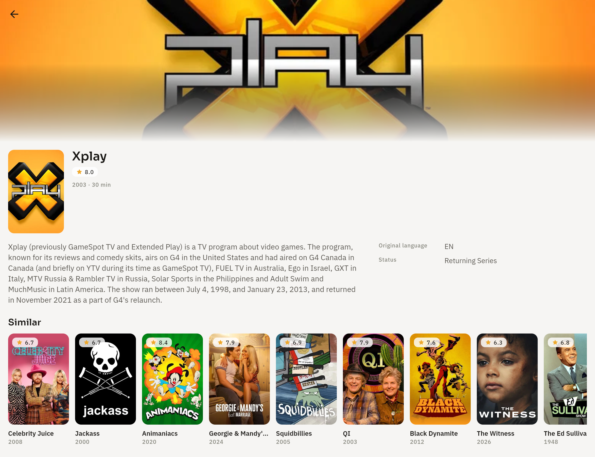
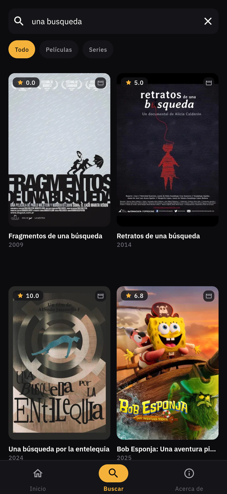
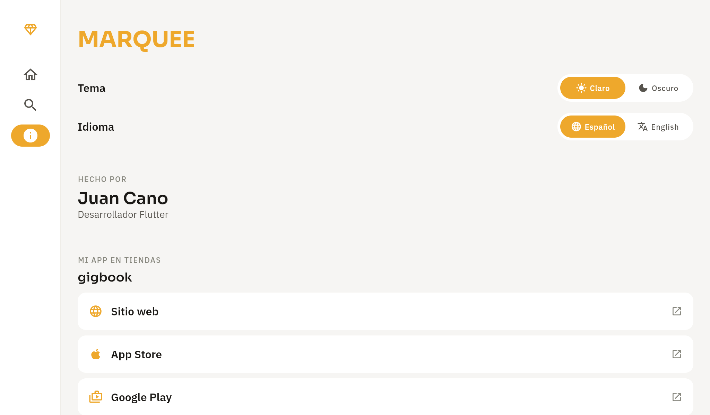
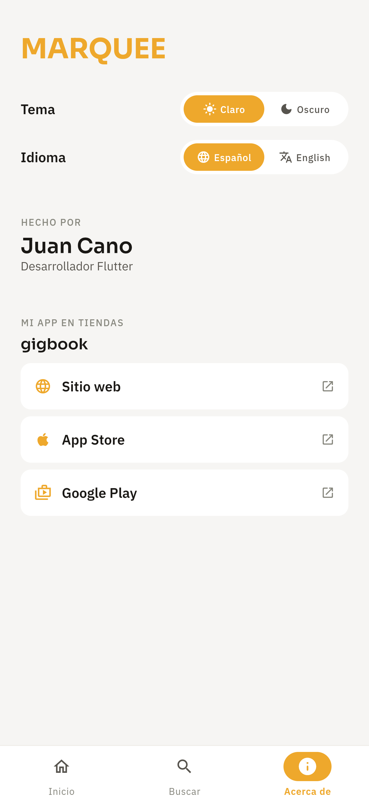

# Marquee — Catálogo de Películas y Series

Aplicación Flutter de catálogo de **películas y series** (datos de [TMDB](https://developers.themoviedb.org/3)) que permite explorar títulos **Popular** y **Top Rated**, ver su detalle y buscarlos por nombre. Es **offline-first**, **multi-idioma (es/en)**, con **modo claro/oscuro** y animaciones (Hero, parallax, entrada escalonada).

Ejercicio técnico. El uso de IA está documentado en [`docs/ai-usage.md`](docs/ai-usage.md).

---

## ✨ Características

- **Catálogo (HU-1):** carruseles Popular y Top Rated, con toggle **Películas / Series** y **scroll infinito** (paginación).
- **Detalle (HU-2):** backdrop colapsable con **parallax**, transición **Hero** del poster desde el listado, sinopsis, géneros, reparto, ficha técnica (director, idioma, estado) y carrusel de **Similares**.
- **Búsqueda (HU-3):** por nombre con **debounce**, resultados combinados con **filtro por tipo** y estados inicial / vacío / sin conexión.
- **Offline-first:** la caché local (Drift) es la fuente de verdad; sin conexión se sigue mostrando lo cacheado, con banner y micro-interacción (borde rojo/verde).
- **i18n:** español (por defecto) e inglés con **selector manual**; el idioma también aplica a los datos de TMDB.
- **Tema** claro/oscuro y estados de UI por pantalla (loading/data/empty/error).
- **Testing:** unitarios de dominio/data, integración con Drift en memoria y widget test; CI en GitHub Actions.

---

## 📸 Capturas

Diseño responsive en los 4 breakpoints, con navegación adaptativa (bottom nav
en móvil, rail en tablet, sidebar extendido en escritorio) y temas claro/oscuro.

### Catálogo

| Escritorio — sidebar + hero (tema claro) | Móvil — bottom nav + hero (tema oscuro) |
|:---:|:---:|
|  |  |

### Detalle y búsqueda

| Detalle — layout a dos columnas | Búsqueda con filtros |
|:---:|:---:|
|  |  |

### Acerca de — tema e idioma a demanda

| Tablet — rail (tema claro) | Móvil (tema claro) |
|:---:|:---:|
|  |  |

---

## ⏱️ Tiempo de desarrollo

Cronología real, tomada de los timestamps de `git log` (nada estimado):

```mermaid
gantt
    title MARQUEE — 45 commits, de cero a responsive
    dateFormat  YYYY-MM-DD HH:mm
    axisFormat  %H:%M

    section 1 jul
    Encuadre, ADRs y andamiaje Melos       :done, 2026-07-01 17:10, 2026-07-01 18:05
    M1 · Catálogo (HU-1)                   :done, 2026-07-01 18:32, 2026-07-01 18:49
    i18n (slang) + fix toggle              :done, 2026-07-01 20:14, 2026-07-01 20:31
    M3 · Detalle, nav y animaciones        :done, 2026-07-01 21:41, 2026-07-01 21:55
    M4 · Offline-first (Drift) + banner    :done, 2026-07-01 22:16, 2026-07-01 22:43
    M5 · Buscador (HU-3)                   :done, 2026-07-01 22:55, 2026-07-01 22:56
    Pulido: ficha, similares, parallax     :done, 2026-07-01 23:11, 2026-07-01 23:38
    README y CI                            :done, 2026-07-01 23:45, 2026-07-01 23:54
    section 2 jul
    Responsive 4 breakpoints + Acerca de   :done, 2026-07-02 00:09, 2026-07-02 00:45
    Píldoras, scroll infinito y capturas   :done, 2026-07-02 00:51, 2026-07-02 01:48
```

**45 commits** · **~4h 20min de trabajo activo** (la suma de los tramos entre
el primer y el último commit de cada bloque; los huecos entre bloques son
pausas reales, no trabajo) dentro de una **ventana de 8h 38min** en dos
sesiones · 10 milestones, cada uno cerrado con `analyze` + tests en verde y
su entrada en la bitácora ([`docs/ai-usage.md`](docs/ai-usage.md)).

---

## 🚀 Puesta en marcha

### Requisitos

- **Flutter 3.44.2** (stable) o superior — el ejercicio pide 3.35.7+; se usa una versión estable vigente (la numeración de Dart y Flutter difiere).
- Un **TMDB API Read Access Token (v4)** — el token largo de *Settings → API → API Read Access Token* (no la "API Key v3").

### 1. Token de TMDB (nunca se commitea)

```bash
cp env/tmdb.example.json env/tmdb.json
# edita env/tmdb.json y pega tu token en TMDB_ACCESS_TOKEN
```

`env/tmdb.json` está en `.gitignore`; el token se inyecta en tiempo de compilación con `--dart-define-from-file`, nunca se hardcodea.

### 2. Dependencias y generación de código

```bash
flutter pub get                 # resuelve el workspace (pub workspaces)
dart run melos run i18n         # traducciones (slang)
dart run melos run generate     # build_runner (freezed, json, riverpod, drift)
```

### 3. Correr la app

```bash
cd packages/app
flutter run --dart-define-from-file=../../env/tmdb.json          # dispositivo/emulador
flutter run -d chrome --dart-define-from-file=../../env/tmdb.json # web (Drift sobre WASM)
```

En VS Code hay configuraciones en `.vscode/launch.json` ("Marquee (debug)" / "(Chrome / web)") que inyectan el token automáticamente.

### Tests y análisis

```bash
dart run melos run analyze      # análisis estático (very_good_analysis) de todo el workspace
dart run melos run test         # tests de todos los paquetes
```

---

## 🏗️ Arquitectura

**Clean Architecture feature-first** en un **monorepo Melos** (pub workspaces). Cada feature contiene sus capas `domain` / `data` / `presentation`; `core`, `design_system` e `i18n` son transversales.

| Paquete                    | Responsabilidad                                                            |
|----------------------------|----------------------------------------------------------------------------|
| `app`                      | Entrypoint, DI (ProviderScope), router (go_router + bottom nav), tema, shell |
| `core`                     | `ApiClient` (Dio), `Result`/`Failure` (fpdart), conectividad, logging (Talker), `AppConfig` |
| `design_system`            | Tokens MARQUEE (claro/oscuro), tipografía empaquetada, componentes, animaciones |
| `i18n`                     | Traducciones type-safe (slang) + control de locale (es por defecto)        |
| `features/feature_catalog` | Feature de catálogo: `domain` / `data` / `presentation` (browse/detail/search) |

**Regla de dependencia:** `app → {feature_catalog, core, design_system, i18n}`, `feature_catalog → {core, design_system, i18n}`, `core`/`design_system` → ∅. Nada apunta a `app`.

El **contrato del repositorio es reactivo** (`Stream<Either<Failure, T>>`) desde el inicio: eso permitió el swap de la caché en memoria a **Drift (single-source-of-truth)** sin tocar dominio ni UI.

Las decisiones están registradas como ADRs en [docs/adr/](docs/adr/README.md), y el comportamiento en el spec [.specs/features/catalog.md](.specs/features/catalog.md).

---

## 🧰 Stack

| Área | Elección | Por qué |
|---|---|---|
| Estado / DI | **Riverpod** (+ generator) | `AsyncValue`, DI sin service locator, testeable |
| Persistencia | **Drift** (SQLite; WASM en web) | offline-first reactivo (`watch`), type-safe, soporte web |
| Navegación | **go_router** (`StatefulShellRoute`) | URLs/deep-linking web, shell con bottom nav |
| i18n | **slang** | claves type-safe, sin strings mágicos |
| Errores | **fpdart** `Either<Failure, T>` | rutas de fallo explícitas, sin `try/catch` disperso |
| Modelos data | **freezed** + json_serializable | DTOs inmutables con (de)serialización |
| Logging | **Talker** | interceptor Dio + observer Riverpod + UI de logs |
| Conectividad | connectivity_plus + internet_connection_checker_plus | distingue "hay red" de "hay internet" |
| Linter | **very_good_analysis** (VGV) | reglas estrictas, consistencia |

---

## 🧭 Decisiones y trade-offs destacados

- **Offline-first como SSOT reactivo:** `watchCategory` emite desde Drift; `refreshCategory` actualiza la caché. Sin red, se sigue sirviendo lo cacheado (verificado por test).
- **`go_router` en vez de `fluro`** (recomendado por el enunciado): mejor soporte web/deep-linking y mantenimiento activo (ver [ADR-0005](docs/adr/0005-go-router-over-fluro.md)).
- **Navegación desacoplada:** las features emiten `onOpenMedia`; el `app` resuelve la ruta (la feature no conoce go_router). El `Media` se pasa como `extra` **solo como optimización** del Hero (poster en el frame 0); la ruta funciona con `type + id`, así que **deep-links y recargas no se rompen**.
- **Fuentes empaquetadas** (Sora + IBM Plex) en vez de `google_fonts`, coherente con offline-first.
- **`public_member_api_docs` desactivado** en VGV: paquetes internos + estilo sin comentarios redundantes.

---

## 🔭 Fuera de alcance — cómo lo haría

Priorizando lo que el enunciado pide, quedó fuera (y así lo abordaría):

- **Autenticación / sesión TMDB, watchlist y ratings del usuario** → los tabs *Saved/You* del diseño; requiere flujo de sesión de TMDB, persistencia de listas y providers de usuario.
- **Reproducción de tráilers** → `videos` de TMDB + reproductor de YouTube embebido.
- **Notificaciones push** → FCM + deep-linking a detalle.
- **Responsive desktop/tablet pulido** → los grids 4/5 columnas del diseño con `LayoutBuilder`/breakpoints (hoy mobile-first).
- **Paginación en búsqueda** e infinite scroll de resultados.
- **Golden tests** y *coverage gate* en CI.
- **Migraciones Drift versionadas** para evolución de esquema.

---

## 🤖 Uso de IA

Se usó **Claude (Anthropic)** vía Claude Code como par de programación, para acelerar sin reemplazar criterio: todas las decisiones arquitectónicas se revisaron y aprobaron. La bitácora honesta está en [`docs/ai-usage.md`](docs/ai-usage.md).

---

## 📂 Estructura

```
.
├── packages/
│   ├── app/                    # entrypoint, router, shell, tema
│   ├── core/                   # networking, result/failure, conectividad, logging
│   ├── design_system/          # tokens MARQUEE, componentes, animaciones
│   ├── i18n/                   # slang (es/en) + control de locale
│   └── features/feature_catalog/
│       └── lib/src/{domain,data,presentation}/
├── docs/
│   ├── adr/                    # decisiones arquitectónicas
│   ├── ai-usage.md             # bitácora de IA
│   └── execution-plan.md       # plan de ejecución
├── .specs/features/catalog.md  # spec de comportamiento
└── env/tmdb.example.json       # plantilla del token
```
